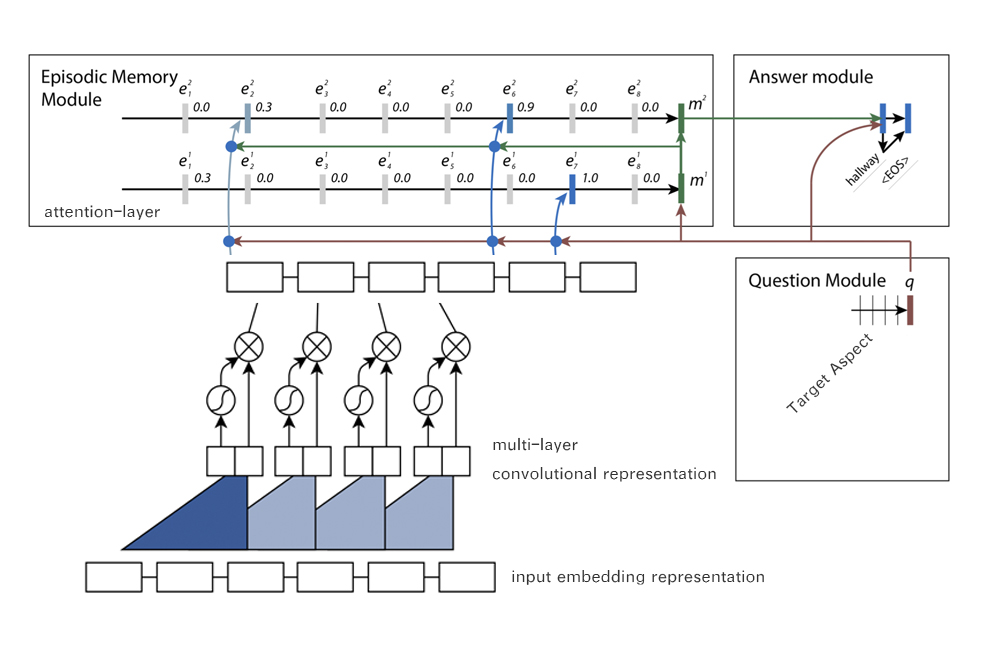
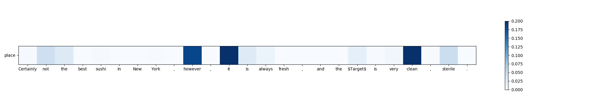

## Introduction
Attention-based aspect-level sentiment classification(demo version). Implemented by tensorflow.  
Revised for analyzing short text documents.

Download the git project and run the python script: aspect_level_sentiment_analysis_XXXXXXXX.py

## Version Requirements
1. Tensorflow 1.4+
2. Python 3.x
3. Numpy
4. Matplotlib

## Basic Modules
1. Implementation of Dynamic Memory Networks from Textual Question Answering.
2. Attention-based LSTM for Aspect-level Sentiment Classification.
3. Convolutional representation of sequnces as learning input.

## Some Specific Changes
1. Simplifying the implemetation from original dynamic memory network in reference[1].  
2. Combining some parts of reference[2].  
3. Adding simple attention visualization.  
  

## Layout

## Attention Plot  

## References
1. Dynamic Memory Networks for Natural Language Processing  
https://arxiv.org/abs/1506.07285

2. Attention-based LSTM for Aspect-level Sentiment Classification  
http://www.aclweb.org/anthology/D/D16/D16-1058.pdf

3. Convolutional Sequence to Sequence Learning   
https://arxiv.org/abs/1705.03122
    
      
      
Feedback and suggestions are warmly welcome.  
